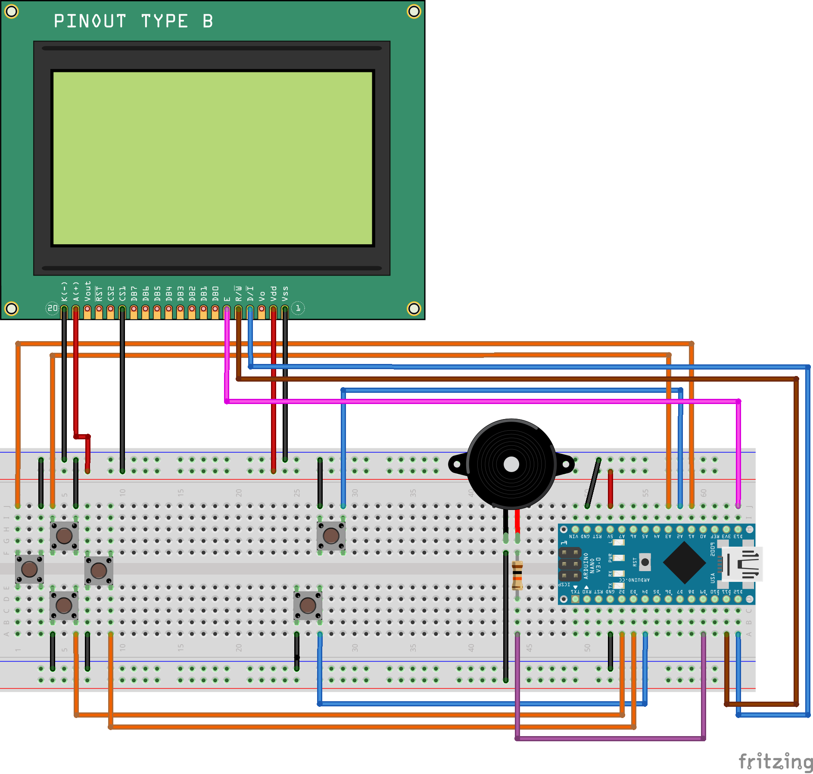

# SLIMBOYXL - Slimboy port to st7920 lcd

This is a port of the [Slimboy](https://github.com/harbaum/Arduboy2) library.

## Requirements:
- https://github.com/cbm80amiga/ST7920_SPI

## Breadboard:

## NOTE:
- not all games work with this port
- the framebuffer is different
- this has only been tested for arduino uno/nano
- im bad at programming
- it's not finished
